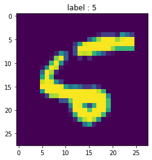

# classifying handwritten digits with tf learn using linear classifier 


```python
import numpy as np

import matplotlib.pyplot as plt
%matplotlib inline

import tensorflow as tf
learn = tf.contrib.learn
tf.logging.set_verbosity(tf.logging.ERROR)
```


```python
# learn in module in tensorflow which will provide dataset 
learn
```


    <module 'tensorflow.contrib.learn' from '/usr/local/lib/python3.6/dist-packages/tensorflow/contrib/learn/__init__.py'>


# importing dataset using mnist


```python
#this is how mnist is used mnist contain test and train dataset
mnist = learn.datasets.load_dataset('mnist')
data = mnist.train.images
labels = np.asarray(mnist.train.labels, dtype=np.int32)
test_data = mnist.test.images
test_labels = np.asarray(mnist.test.labels, dtype=np.int32)
```

    Extracting MNIST-data/train-images-idx3-ubyte.gz
    Extracting MNIST-data/train-labels-idx1-ubyte.gz
    Extracting MNIST-data/t10k-images-idx3-ubyte.gz
    Extracting MNIST-data/t10k-labels-idx1-ubyte.gz


```python
max_examples = 10000
data = data[:max_examples]
labels = labels[:max_examples]
```

# displaying dataset using matplotlib


```python
def display(i):
    img = test_data[i]
    plt.title('label : {}'.format(test_labels[i]))
    plt.imshow(img.reshape((28,28)))
    
# img in tf is 28 by 28 px
```


```python
display(0)
```


```python
display(100)
```


```python
display(8)
```





# fitting linear classifier


```python
feature_columns = learn.infer_real_valued_columns_from_input(data)

```


```python
classifier = learn.LinearClassifier(n_classes=10,feature_columns=feature_columns)
```


```python
classifier
```


    LinearClassifier(params={'head': <tensorflow.contrib.learn.python.learn.estimators.head._MultiClassHead object at 0x7efbeb698710>, 'feature_columns': [_RealValuedColumn(column_name='', dimension=784, default_value=None, dtype=tf.float32, normalizer=None)], 'optimizer': None, 'gradient_clip_norm': None, 'joint_weights': False})


```python
classifier.fit(data,labels,batch_size=100,steps=1000)
```


    LinearClassifier(params={'head': <tensorflow.contrib.learn.python.learn.estimators.head._MultiClassHead object at 0x7efbeb698710>, 'feature_columns': [_RealValuedColumn(column_name='', dimension=784, default_value=None, dtype=tf.float32, normalizer=None)], 'optimizer': None, 'gradient_clip_norm': None, 'joint_weights': False})


#  Evaluate accuracy


```python
classifier.evaluate(test_data, test_labels)
print(classifier.evaluate(test_data, test_labels)["accuracy"])
```

    0.9137


```python
#print ("Predicted {}, Label: {}".format(classifier.predict(test_data[0]),test_labels[0]))
#this does not work for me 
# https://github.com/random-forests/tutorials/issues/4

prediction = classifier.predict(np.array([test_data[0]], dtype=float), as_iterable=False)
print("prediction : {} , label : {}".format(prediction,test_labels[0]) )
if prediction == test_labels[0]:
    print("\t\t\tworks fine")
display(0)
```

    prediction : [7] , label : 7
    			works fine


```python

```
