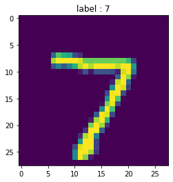

```python
import numpy as np

import matplotlib.pyplot as plt
%matplotlib inline

import tensorflow as tf
learns = tf.contrib.learn
error=tf.logging.set_verbosity(tf.logging.ERROR)
```


```python
# learn in module in tensorflow which will provide dataset 
learns
```


    <module 'tensorflow.contrib.learn' from '/usr/local/lib/python3.6/dist-packages/tensorflow/contrib/learn/__init__.py'>


# importing dataset using mnist


```python


mnist = learns.datasets.load_dataset('mnist')
data = mnist.train.images
label=np.asarray(mnist.train.labels,dtype=np.int32)
test_data=mnist.test.images
test_labels = np.asarray(mnist.test.labels,dtype=np.int32)
```

    Extracting MNIST-data/train-images-idx3-ubyte.gz
    Extracting MNIST-data/train-labels-idx1-ubyte.gz
    Extracting MNIST-data/t10k-images-idx3-ubyte.gz
    Extracting MNIST-data/t10k-labels-idx1-ubyte.gz


```python
max_example = 100
data = data[max_example]
label=label[max_example]
```

# displaying dataset using matplotlib


```python
def display(i):
    img = test_data[i]
    plt.title('label : {}'.format(test_labels[i]))
    plt.imshow(img.reshape((28,28)))
    
# img in tf is 28 by 28 px
```


```python
display(0)
```





```python
display(100)
```


```python
display(8)
```


# fitting linear classifier


```python
feature_columns=learns.infer_real_valued_columns_from_input(data)
```


```python
feature_columns
```


    [_RealValuedColumn(column_name='', dimension=1, default_value=None, dtype=tf.float32, normalizer=None)]


```python
classifier = learns.LinearClassifier(n_classes=10,feature_columns=feature_columns)
```


```python
classifier
```


    LinearClassifier(params={'head': <tensorflow.contrib.learn.python.learn.estimators.head._MultiClassHead object at 0x7f8b79bdc5f8>, 'feature_columns': [_RealValuedColumn(column_name='', dimension=1, default_value=None, dtype=tf.float32, normalizer=None)], 'optimizer': None, 'gradient_clip_norm': None, 'joint_weights': False})


```python
classifier.fit(data,label,batch_size=100,steps=1000)
```


    ---------------------------------------------------------------------------

    IndexError                                Traceback (most recent call last)

    <ipython-input-121-a52972056153> in <module>
    ----> 1 classifier.fit(data,label,batch_size=100,steps=1000)
    

    /usr/local/lib/python3.6/dist-packages/tensorflow/python/util/deprecation.py in new_func(*args, **kwargs)
        505                 'in a future version' if date is None else ('after %s' % date),
        506                 instructions)
    --> 507       return func(*args, **kwargs)
        508 
        509     doc = _add_deprecated_arg_notice_to_docstring(


    /usr/local/lib/python3.6/dist-packages/tensorflow/contrib/learn/python/learn/estimators/estimator.py in fit(self, x, y, input_fn, steps, batch_size, monitors, max_steps)
        506     _verify_input_args(x, y, input_fn, None, batch_size)
        507     if x is not None:
    --> 508       SKCompat(self).fit(x, y, batch_size, steps, max_steps, monitors)
        509       return self
        510 


    /usr/local/lib/python3.6/dist-packages/tensorflow/contrib/learn/python/learn/estimators/estimator.py in fit(self, x, y, batch_size, steps, max_steps, monitors)
       1524         steps=steps,
       1525         max_steps=max_steps,
    -> 1526         monitors=all_monitors)
       1527     return self
       1528 


    /usr/local/lib/python3.6/dist-packages/tensorflow/python/util/deprecation.py in new_func(*args, **kwargs)
        505                 'in a future version' if date is None else ('after %s' % date),
        506                 instructions)
    --> 507       return func(*args, **kwargs)
        508 
        509     doc = _add_deprecated_arg_notice_to_docstring(


    /usr/local/lib/python3.6/dist-packages/tensorflow/contrib/learn/python/learn/estimators/estimator.py in fit(self, x, y, input_fn, steps, batch_size, monitors, max_steps)
        522       hooks.append(basic_session_run_hooks.StopAtStepHook(steps, max_steps))
        523 
    --> 524     loss = self._train_model(input_fn=input_fn, hooks=hooks)
        525     logging.info('Loss for final step: %s.', loss)
        526     return self


    /usr/local/lib/python3.6/dist-packages/tensorflow/contrib/learn/python/learn/estimators/estimator.py in _train_model(self, input_fn, hooks)
       1092         loss = None
       1093         while not mon_sess.should_stop():
    -> 1094           _, loss = mon_sess.run([model_fn_ops.train_op, model_fn_ops.loss])
       1095       return loss
       1096 


    /usr/local/lib/python3.6/dist-packages/tensorflow/python/training/monitored_session.py in run(self, fetches, feed_dict, options, run_metadata)
        752         feed_dict=feed_dict,
        753         options=options,
    --> 754         run_metadata=run_metadata)
        755 
        756   def run_step_fn(self, step_fn):


    /usr/local/lib/python3.6/dist-packages/tensorflow/python/training/monitored_session.py in run(self, fetches, feed_dict, options, run_metadata)
       1250             feed_dict=feed_dict,
       1251             options=options,
    -> 1252             run_metadata=run_metadata)
       1253       except _PREEMPTION_ERRORS as e:
       1254         logging.info(


    /usr/local/lib/python3.6/dist-packages/tensorflow/python/training/monitored_session.py in run(self, *args, **kwargs)
       1351         raise six.reraise(*original_exc_info)
       1352       else:
    -> 1353         raise six.reraise(*original_exc_info)
       1354 
       1355 


    ~/.local/lib/python3.6/site-packages/six.py in reraise(tp, value, tb)
        691             if value.__traceback__ is not tb:
        692                 raise value.with_traceback(tb)
    --> 693             raise value
        694         finally:
        695             value = None


    /usr/local/lib/python3.6/dist-packages/tensorflow/python/training/monitored_session.py in run(self, *args, **kwargs)
       1336   def run(self, *args, **kwargs):
       1337     try:
    -> 1338       return self._sess.run(*args, **kwargs)
       1339     except _PREEMPTION_ERRORS:
       1340       raise


    /usr/local/lib/python3.6/dist-packages/tensorflow/python/training/monitored_session.py in run(self, fetches, feed_dict, options, run_metadata)
       1400     options = options or config_pb2.RunOptions()
       1401     feed_dict = self._call_hook_before_run(run_context, actual_fetches,
    -> 1402                                            feed_dict, options)
       1403 
       1404     # Do session run.


    /usr/local/lib/python3.6/dist-packages/tensorflow/python/training/monitored_session.py in _call_hook_before_run(self, run_context, fetch_dict, user_feed_dict, options)
       1427     hook_feeds = {}
       1428     for hook in self._hooks:
    -> 1429       request = hook.before_run(run_context)
       1430       if request is not None:
       1431         if request.fetches is not None:


    /usr/local/lib/python3.6/dist-packages/tensorflow/python/training/basic_session_run_hooks.py in before_run(self, run_context)
        983   def before_run(self, run_context):  # pylint: disable=unused-argument
        984     return session_run_hook.SessionRunArgs(
    --> 985         fetches=None, feed_dict=self.feed_fn())
        986 
        987 


    /usr/local/lib/python3.6/dist-packages/tensorflow/contrib/learn/python/learn/learn_io/data_feeder.py in _feed_dict_fn()
        569         feed_dict.update({
        570             self._output_placeholder.name:
    --> 571                 assign_label(self._y, shape, dtype, n_classes, batch_indices)
        572         })
        573 


    /usr/local/lib/python3.6/dist-packages/tensorflow/contrib/learn/python/learn/learn_io/data_feeder.py in assign_label(data, shape, dtype, n_classes, indices)
        507         # self.n_classes is None means we're passing in raw target indices
        508         if n_classes is None:
    --> 509           out[i] = _access(data, sample)
        510         else:
        511           if n_classes > 1:


    /usr/local/lib/python3.6/dist-packages/tensorflow/contrib/learn/python/learn/learn_io/data_feeder.py in _access(data, iloc)
        275     if isinstance(data, pd.Series) or isinstance(data, pd.DataFrame):
        276       return data.iloc[iloc]
    --> 277   return data[iloc]
        278 
        279 


    IndexError: invalid index to scalar variable.


```python

```
